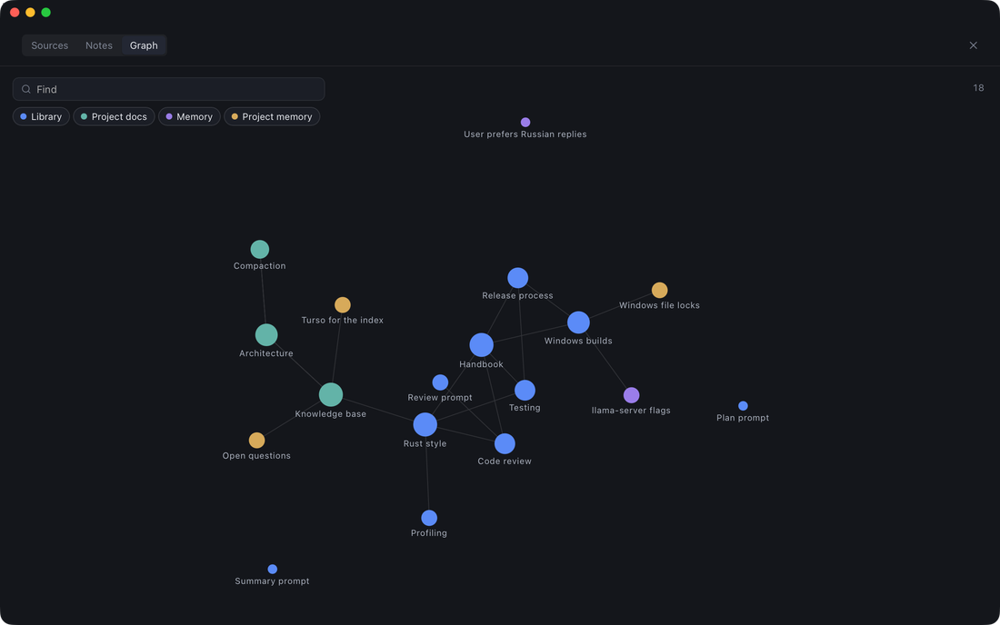
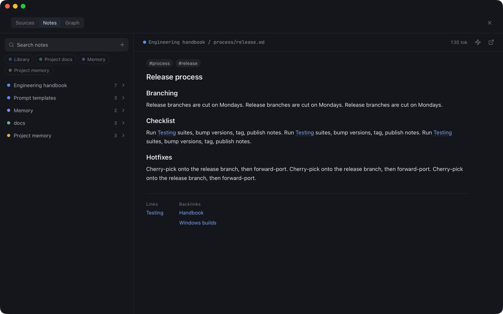
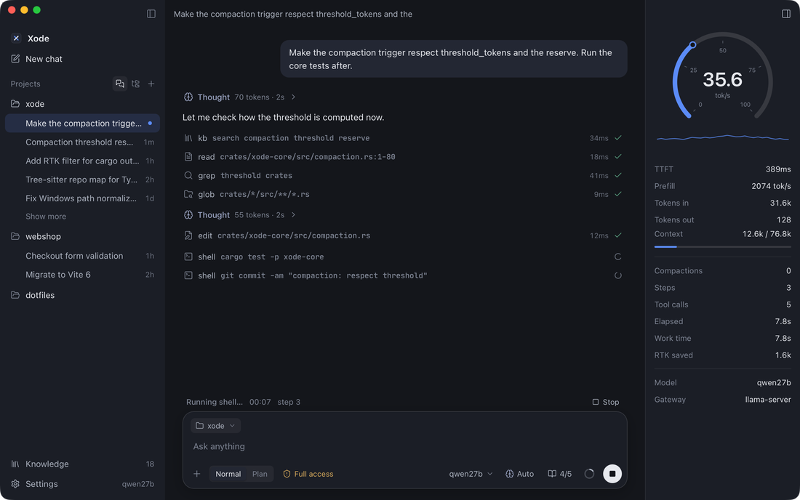

<p align="center">
  <picture>
    <source media="(prefers-color-scheme: dark)" srcset="docs/media/header.svg">
    
  </picture>
</p>

<p align="center">
<b>A coding agent built for local models with small context windows.</b> Xode works for hours inside an 80k window. When the window fills up, it compacts itself into a short handoff note and keeps going. It navigates code through a tree-sitter index instead of reading whole files, and it looks things up in a knowledge base that can hold gigabytes of your docs plus everything the agent has learned. It comes as a native desktop app and a terminal UI, and runs on macOS, Windows and Linux.
</p>

<p align="center">
  
  
  
  
  
  
  
</p>

<p align="center">
  
</p>

---

## Why

Local models (Qwen, Llama, DeepSeek, GLM …) running on your own GPU usually have **60–100k tokens** of usable context. Agents built for 200k cloud windows fail on them within minutes: a few file reads and one noisy `cargo test` fill the window, and the model loses the task.

Xode treats the context window as its scarcest resource:

| | |
|---|---|
| **Self-compaction** | Near the limit, the model writes a short `PATH` entry (what was done) and a `STATE` (goal, decisions, next step). Xode restarts from those plus the working set, with no limit on how many times this happens. |
| **Structure instead of text** | A tree-sitter index answers "where is X defined, who calls it, what's in this file" with a few lines instead of whole files. |
| **Output filters** | RTK-style filters cut git, cargo, npm, pytest, jest and similar output down to failures and summaries. |
| **Knowledge base** | Gigabytes of docs, skills and templates, plus what the agent has learned, available through one small tool that reads outline-first. |
| **Every token is visible** | A context view breaks usage down by system prompt, tools, repo map, PATH, state, working set, messages, and tool results per tool. |

## Knowledge base

<p align="center"></p>

The knowledge base has four layers. Every note is a plain Markdown file (`[[wiki links]]`, `#tags`, front matter), so any of these folders can also be opened as an Obsidian vault.

| Layer | Scope | Written by | Lives in |
|---|---|---|---|
| **Library** | all projects | you (read-only for the agent) | your folders, indexed in place; can be gigabytes |
| **Project docs** | one project | you (read-only for the agent) | folders of the project, e.g. `docs/` |
| **Memory** | all projects | the agent (and you) | `<app data>/xode/memory/*.md` |
| **Project memory** | one project | the agent (and you) | `<project>/.xode/memory/*.md` |

**Per-chat control.** Any layer or source can be switched off for a single chat from the composer, or with `/kb off <source|layer>`. Sources also have an "on for new chats" default. If everything is off, the tool is not even registered.

**Built for small models.** The model gets one compact tool, and every result carries its token cost so the model can budget:

```text
kb search{q}              → ranked hits: id · title › heading · lines · chunk/note tokens · one-line snippet
kb read{id}               → short notes in full; long notes return an outline first (headings with token counts)
kb read{id, section}      → just that section, capped, with a "continue with lines=…" hint
kb list{path|tag} · kb links{id}              → browse folders and tags, follow links and backlinks
kb write{title, body, tags} · kb delete{id}   → memory layers only
```

**Search is hybrid.**
- Full-text search uses tantivy through Turso.
- Vector search runs in two stages: an in-memory scan of 1-bit sign codes (48 bytes per chunk), then exact cosine rescoring in Turso with `vector_distance_cos`.
- The two result lists are merged with reciprocal-rank fusion and grouped by note.

Embeddings come from a built-in multilingual ONNX model (`multilingual-e5-small`, CPU), or from your gateway's `/v1/embeddings`. Text search is available as soon as the text is indexed, and vectors are added in the background.

| 100 MB of Markdown (11k notes, 68k chunks) on an M-series laptop | |
|---|---|
| indexing text (parse, chunk, links, FTS) | **2.7 s** |
| hybrid search | **70–120 ms** |
| link graph, 4 000 nodes | **12 ms** |

**In the app:**
- **Sources:** add folders and watch indexing and embedding progress.
- **Notes:** search, a folder browser, a reader with clickable links and backlinks, and an editor for memory notes.
- **Graph:** a canvas force layout with filters by layer, find, and a local-neighbourhood view.

<p align="center"></p>

## Context management

<p align="center"></p>

The prompt is assembled from measured sections: **system**, **tools**, **repo map**, **PATH.md**, **state**, **working set**, **messages**, **tool results** (per tool), **thinking** and **attachments**. Tokens are counted with cl100k and calibrated against the real prompt size the server reports.

**Compaction** runs automatically at a threshold (82% by default, keeping a reserve for the reply), or when you type `/compact`. A queued `/compact` runs at the next tool boundary.

1. A silent request asks the model for `PATH` (the steps since the last compaction, at most 60 lines) and `STATE` (goal, decisions, current and next step, open problems; at most 180 words). Tools are disabled for that request, and progress is shown live.
2. `PATH` is appended to `<project>/.xode/PATH.md`, and old blocks are folded so the file stays short.
3. The new context holds the system prompt, repo map, PATH, STATE, the original request, the last two messages, and the **working set**. The working set lists every file the agent touched, with a hash, a symbol outline and why it mattered, but never the file contents.
4. `read` keeps a hash cache. Asking again for an unchanged file returns its outline and "unchanged since step N" instead of the full text.
5. Each compaction is stored as a segment, so the full history stays browsable in the context view.

**Other token savers:**
- **`code` tool:** `map`, `outline`, `find`, `refs`, `read`, and `edit` on a single symbol, over a tree-sitter + Turso index that a file watcher keeps current.
- **Output filters:**
  - strip ANSI codes, collapse progress bars, merge repeated lines;
  - per-command filters (git status/diff/log, cargo, npm/pnpm/yarn, pytest, jest/vitest, tsc, eslint, directory listings);
  - keep the head and tail of long output, with the full output saved to a file.
- **Read limits:** reads return a limited range of lines, and edits return compact diffs.
- **Goal hook:** after `/goal <text>`, a separate judge call checks each finished turn and sends the agent back to work until the goal is met.
- **Reasoning effort:** auto, off, low, medium or high, mapped to each server's own options, with thinking budgets.

## How it's built

```
crates/
  xode-core     types, events, config, SQLite chat store, providers (OpenAI-compatible + Anthropic, SSE),
                context accounting, compaction, agent loop, permissions
  xode-tools    read / write / edit / glob / grep (in-process ripgrep) / shell + RTK filters
  xode-index    tree-sitter symbol + reference index, repo map (PageRank), `code` tool
  xode-db       sync, rusqlite-style facade over Turso (vectors, FTS, shared read-only fallback)
  xode-kb       knowledge base: 4 layers, ingest/watch/embed, hybrid search, `kb` tool
  xode-net      web search (DuckDuckGo, SearXNG, Brave, Tavily), fetch → markdown, browser over CDP, MCP client
  xode-engine   the only API frontends use: sessions, runs, queue/steer, slash commands, rewind, undo
  xode-cli      `xode`: ratatui terminal UI and headless `-p` mode
apps/desktop    Tauri 2 shell + SolidJS UI
```

**Engine and events.** The engine emits one stream of `AgentEvent`s: deltas, tool calls, stats, compaction progress, permission asks, queue changes and knowledge-base progress. The desktop app and the terminal UI render the same stream.

**Gateways.** Xode detects servers by probing, including a port scan for llama.cpp, Ollama, LM Studio and vLLM. It reads the real `n_ctx` from `/props` and understands both native and text-format tool calls.

**Desktop app.**
- Codex-style layout: projects and chats on the left, the chat in the middle, a live speedometer (tok/s, TTFT, prefill) on the right.
- Native translucent window blur.
- Full-screen settings and context view; notifications when the agent needs permission or finishes.
- Right-click a message to copy it or rewind the chat to that point, optionally restoring files.
- Clickable links to files the agent creates, such as pages and images.

**Terminal UI.** The same features in the terminal: stats panel, collapsible thinking and tool rows, slash commands, and a queue while the agent is running.

## Build

```sh
# terminal UI
cargo build --release -p xode-cli        # → target/release/xode

# desktop app
cd apps/desktop && pnpm install && pnpm tauri build
```

Xode picks up any OpenAI-compatible or Anthropic endpoint. On first start it scans localhost for model servers.

## Contributing

Issues and pull requests are welcome: bug reports, filters for more command outputs, tree-sitter languages, gateway quirks, UI polish.

1. Fork, then branch off `main`.
2. Before opening a PR, run the checks:
   ```sh
   cargo test --workspace --exclude xode-desktop
   cd apps/desktop && pnpm install && npx tsc --noEmit
   ```
3. Try the UI without a model: `pnpm dev` in `apps/desktop` runs on the in-browser mock engine. To run the desktop app on the mock engine, set `XODE_DEMO=1`.
4. Keep PRs focused, and describe how you tested them (OS, model, gateway).

House rules:
- **Every token counts.** Tool schemas and tool outputs must stay compact, and new output goes through the caps and filters.
- **The engine is the only API.** Frontends talk to `xode-engine`, never directly to the lower crates.
- **UI:** clean and Codex-like; lucide icons only; no emoji or helper text. Motion is short transform/opacity animations that respect reduced motion.
- **Turso:** its full-text index builds a segment per statement, so write FTS-indexed rows with multi-row `INSERT`s.

<sub>The demo above is the real desktop app, running on its built-in mock engine (`XODE_DEMO=1`) and recorded with `scripts/record-window.swift`.</sub>
